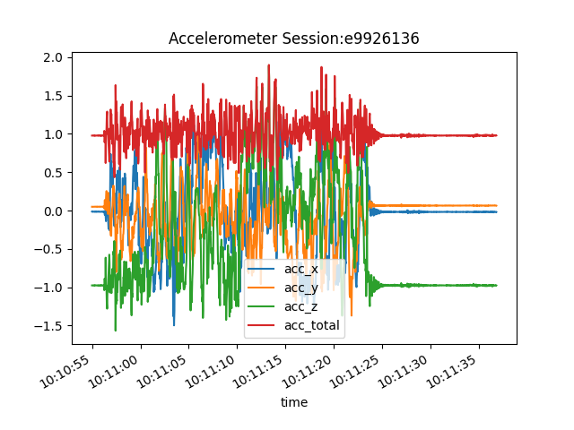

# Quality assurance workflow for imu, magnetometer, and GNSS/imu sync

1. Install a recent firmware on the bee device (>= [5.0.13](https://dashcam-firmware.s3.us-west-2.amazonaws.com/bee/2024-11-27_5-0-13.raucb))

2. git checkout the `derek/fsync` branch of the [hivemapper-data-logger](https://github.com/Hivemapper/hivemapper-data-logger/tree/derek/fsync) repository. 

3. set bee in your `.ssh/config` if necessary for easy ssh connection to the dashcam.

    ```
    Host bee
        HostName 192.168.0.10
        User root
        StrictHostKeyChecking no
    ```

4. Run the `prepare_qa.sh` script from within the `hivemapper-data-logger` directory on the computer (not bee). This script removes any previous database files and then restarts the `hivemapper-data-logger` service. Replace `bee` as needed to match the corresponding host in your `.ssh/config` file. 

    This script is exists in `bee-sensors/qa/prepare_qa.sh` so can be run on computer (not bee) with something similar to this depending on where the `hivemapper-data-logger` and `bee-sensors` repositories are located:

    ```
    cd ~/hivemapper-data-logger/
    bash ~/bee-sensors/qa/prepare_qa.sh
    ```

5. [CHECK 1] Once the above script starts running the `hivemapper-data-logger` service again, in the log output, you should see the fsync interrupt alternating between true and false roughly every other output line. This confirms the GNSS/imu sync is working as expected.

    

6. While the `hivemapper-data-logger` is still running, rotate the camera around in a sphere. The idea is for the camera to be pointed in every direction around a sphere. This allows the magnetometer to collect data from every possible orientation. After this is complete, the `hivemapper-data-logger` service may be stopped.

7. Move the database files from the camera onto your computer. E.g. `scp -r bee:/data/redis_handler/ ~/Downloads/`

8. Plot accelerometer, gyroscope, and magnetometer data with the [imu_mag_qa_checks.py](https://github.com/Hivemapper/bee-sensors/blob/main/qa/imu_mag_qa_checks.py) script from the [bee-sensors](https://github.com/Hivemapper/bee-sensors) repository after updating the `DB_PATH` variable to be the path to the saved database file which should be someting like: `db_path = "/home/user/Downloads/redis_handler/redis_handler-v0-0-3.db"`.

9. [CHECK 2] The accelerometer data should have clear spikes in each axis from movement. When not moving, the total acceleration (acc_total) should be near 1.0.

    

10. [CHECK 3] The gyroscope data should have clear spikes in each axis from movement.

    

11. [CHECK 4] The magnetometer data should be approximately ellipsoidal when plotted in 3D

    

12. [CHECK 5] The `imu_mag_qa_checks.py` file prints out the percent of rows in the database that have erroneous 0.0 values. This value should be <1% in each axis. Example output below.
    ```
    ----------------
    IMU Metrics
    ----------------
    percent rows with zero value acc_x :  0.0
    percent rows with zero value acc_y :  0.07
    percent rows with zero value acc_z :  0.0
    percent rows with zero value gyro_x :  0.3
    percent rows with zero value gyro_y :  0.48
    percent rows with zero value gyro_z :  0.62
    ------------
    MAG Metrics
    ------------
    percent rows with zero value mag_x :  0.0
    percent rows with zero value mag_y :  0.0
    percent rows with zero value mag_z :  0.0


    ```
