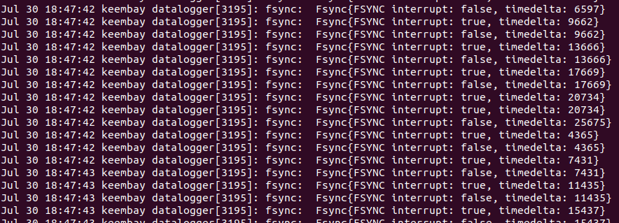

# Quality assurance workflow for imu, magnetometer, and GNSS/imu sync


1. git checkout the `derek/fsync` branch of the [hivemapper-data-logger](https://github.com/Hivemapper/hivemapper-data-logger/tree/derek/fsync) repository. 

2. set bee or bee-wired in your `.ssh/config` if necessary depending on ssh connection type to the dashcam.

    ```
    Host bee
        HostName 192.168.0.10
        User root
        StrictHostKeyChecking no
    Host bee-wired
        HostName 192.168.197.55
        User root
        StrictHostKeyChecking no
    ```

3. Run the following script from the `hivemapper-data-logger` directory. This script removes any previous database files and then restarts the `hivemapper-data-logger` service. Replace `bee` with `bee-wired`, etc. as needed to match the corresponding host in your `.ssh/config` file.

    ```
    #!/bin/bash

    set -x
    GOOS=linux GOARCH=arm64 go build ./cmd/datalogger && \
    ssh -t bee 'systemctl stop odc-api' && \
    ssh -t bee 'systemctl stop hivemapper-data-logger' && \
    ssh -t bee-wired 'rm -rfv /data/recording/*.db*' && \
    ssh -t bee 'mount -o remount,rw /' &&hi
    scp datalogger bee:/opt/dashcam/bin && \
    sleep 2 && \
    ssh -t bee 'systemctl start hivemapper-data-logger' && \
    ssh -t bee 'journalctl -feu hivemapper-data-logger'
    ```

4. [CHECK 1] Once the above script starts running the `hivemapper-data-logger` service again, in the journalctl output, you should see the fsync interrupt alternating between true and false roughly every other output line. This confirms the GNSS/imu sync is working as expected.

    

5. While the `hivemapper-data-logger` is still running, rotate the camera around in a sphere. The idea is for the camera to be pointed in every direction around a sphere. This allows the magnetometer to collect data from every possible orientation. After this is complete, the `hivemapper-data-logger` service may be stopped.

6. Move the database files from the camera onto your computer. E.g. `scp bee:/data/recording/*.db ~/Downloads/`

7. Plot accelerometer, gyroscope, and magnetometer data with the [imu_mag_qa_checks.py](https://github.com/Hivemapper/bee-sensors/blob/main/qa/imu_mag_qa_checks.py) script from the [bee-sensors](https://github.com/Hivemapper/bee-sensors) repository after updating the `DB_PATH` variable to be the path to the saved database file and version number.

8. [CHECK 2] The accelerometer data should have clear spikes in each axis from movement. When not moving, the total acceleration (acc_total) should be near 1.0.

    

9. [CHECK 3] The gyroscope data should have clear spikes in each axis from movement.

    

10. [CHECK 4] The magnetometer data should be approximately ellipsoidal when plotted in 3D

    

